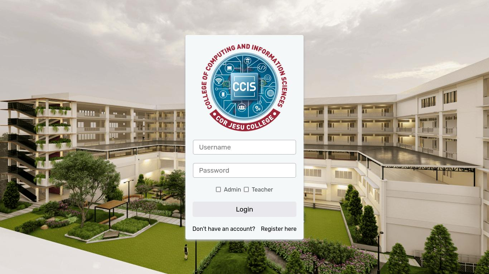
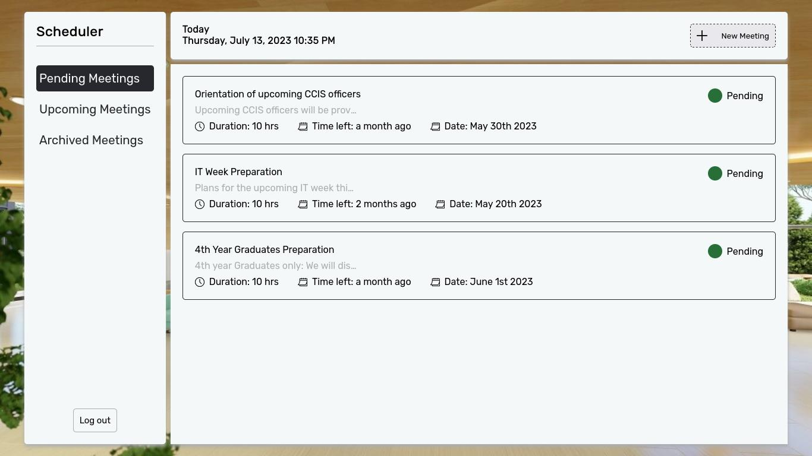
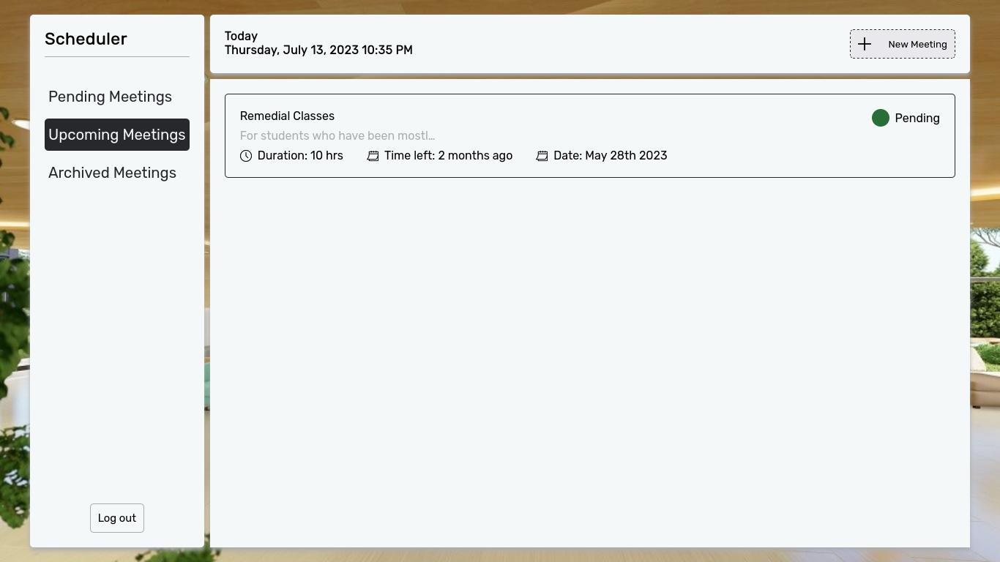

# CCIS-Scheduler
__[View Live Demo](https://ccis-scheduler.onrender.com/)__

# About the Project
Made for the College of Computing and Information Sciences for organizing and setting scheduled meetups between the faculty and the students, whether it be for academic or personal reasons.

